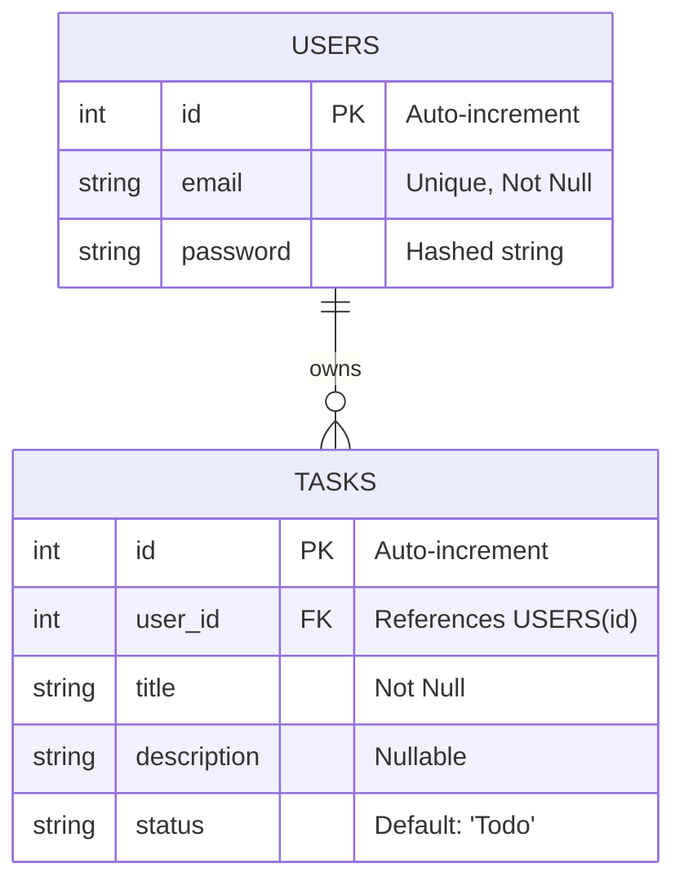

# Task Management Application

This repository contains a full-stack Task Management Application developed as **Task 1** for the **EncoderX Remote Internship** (Track: Full Stack Development).

## 🎯 Objective
The application is a full-featured CRUD (Create, Read, Update, Delete) system that synchronizes frontend state with backend logic. It features data persistence, user registration, login protocols, protected API routes, and a seamless data-fetching routine presented in an ultra-modern "Bold Typography" aesthetic.

## 🚀 Tech Stack
- **Frontend & Backend**: Next.js 15 (React 19), App Router API routes, Tailwind CSS v4, Lucide React
- **Database**: Neon PostgreSQL managed via Drizzle ORM
- **Authentication**: JWT (JSON Web Tokens), `bcryptjs` for secure password hashing
- **Styling**: Tailwind CSS (Custom High-Contrast Dark Theme)

## 📋 Application Workflows

### 1. Registration & Authentication Workflow
The application secures user data using industry-standard JWT authentication.
1. **Sign Up**: Users navigate to the `/register` page and provide an email and password.
   - The backend validates the input and securely hashes the password using `bcryptjs` (salt rounds: 10) before saving it to PostgreSQL.
   - Alternatively, users can use the simulated OAuth options (Google, Facebook, Pinterest) which securely map an identity and provision a backend user automatically.
2. **Sign In**: Returning users authenticate via `/login`.
   - The backend compares the provided password with the stored hash.
3. **Session Management**: Upon successful registration or login, the server generates a JWT signed with a secret key. This token is securely transmitted and attached to future API requests to access protected routes.

### 2. Task Management Workflow (CRUD)
Authenticated users are redirected to the Dashboard where they manage their tasks.
- **Create**: Clicking "NEW TASK" opens a modal. Submitting the form sends a `POST /api/tasks` request, securely linked to the user's ID via the JWT token.
- **Read**: On load, the dashboard fetches user-specific tasks (`GET /api/tasks`) and dynamically groups them into three columns: **TODO**, **IN PROGRESS**, and **DONE**.
- **Update**: Users can edit task details via the edit modal or use quick-action buttons to instantly transition task statuses (`PUT /api/tasks/:id`).
- **Delete**: Users can permanently remove tasks they no longer need (`DELETE /api/tasks/:id`).

## 🗄️ Database Schema Diagram

The database is built on a relational structure using Neon PostgreSQL and Drizzle ORM.



## 🔌 API Reference

### Auth Endpoints
- `POST /api/auth/register`: Create a new user account. Requires `email` and `password`.
- `POST /api/auth/login`: Authenticate an existing user and receive a JWT.
- `POST /api/auth/logout`: Invalidate the current session cookie.
- `GET /api/auth/[provider]/url`: Initialize OAuth flow for third-party providers.

### Task Endpoints (Protected)
*All task endpoints require a valid JWT passed in the `Authorization: Bearer <token>` header or via HTTP-only cookies.*
- `GET /api/tasks`: Retrieve all tasks belonging to the authenticated user.
- `POST /api/tasks`: Create a new task. Requires `title`. `description` and `status` are optional.
- `PUT /api/tasks/:id`: Update an existing task's title, description, or status.
- `DELETE /api/tasks/:id`: Remove a task by its ID.

## 🛠️ Local Development Setup

1. **Install Dependencies:**
   ```bash
   npm install
   ```

2. **Setup Environment Variables:**
   Create a `.env` file in the root directory (based on `.env.example`).
   ```env
   JWT_SECRET="your-super-secret-jwt-key"
   ```
   Set `DATABASE_URL` to the Neon PostgreSQL connection string. Run
   `npm run db:setup` once to create the production tables.
   Google, Facebook, and Pinterest buttons use the built-in local mock callback when
   provider client IDs are not configured, so local testing does not require logging
   in to Google.

3. **Run the Development Server:**
   ```bash
   npm run dev
   ```

4. **Access the App:**
   Open `http://localhost:3000` in your browser.

## ✅ Verification

The deployed application was verified at https://mta-task-app.vercel.app using browser-based QA and live API checks:

- Registration and login
- Matching email and password confirmation during registration
- Strong password policy: 12+ characters with uppercase, lowercase, number, and symbol
- Persistent guest profile creation
- Protected API rejection without authentication
- Create, read, update, and delete task operations
- Task status movement between Todo, In Progress, and Done
- User logout and session invalidation
- Local mock OAuth callback without Google login

Email verification and password-reset email delivery are not enabled yet; they
require a transactional email provider such as Resend or SendGrid.

## 📁 Deliverables Included
- [x] Source Code (Frontend & Backend in Next.js App Router)
- [x] Live Deployment URL (`https://mta-task-app.vercel.app`)
- [x] Database Schema Diagram (Included in this README)
- [x] Postman API Collection Documentation (`postman_collection.json` included in repository)
- [x] Professional README.md
